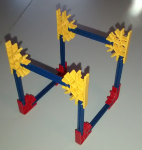
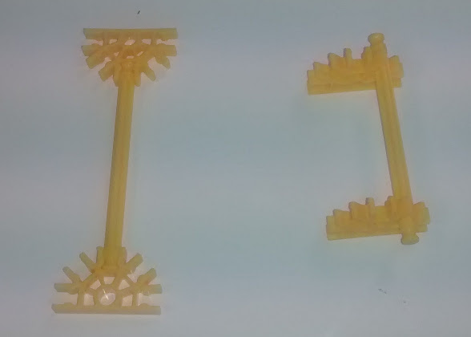
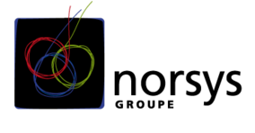
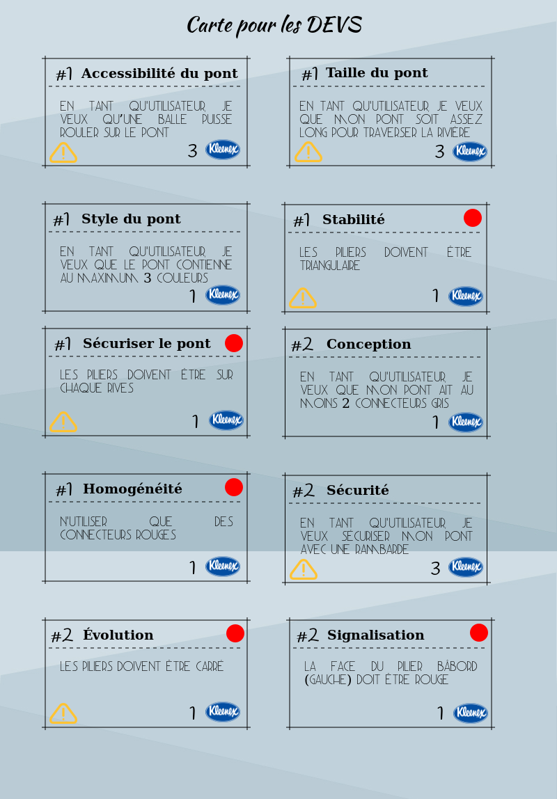
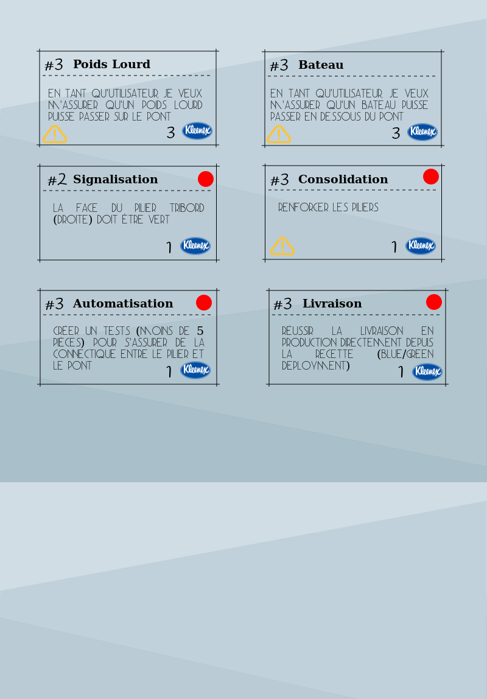
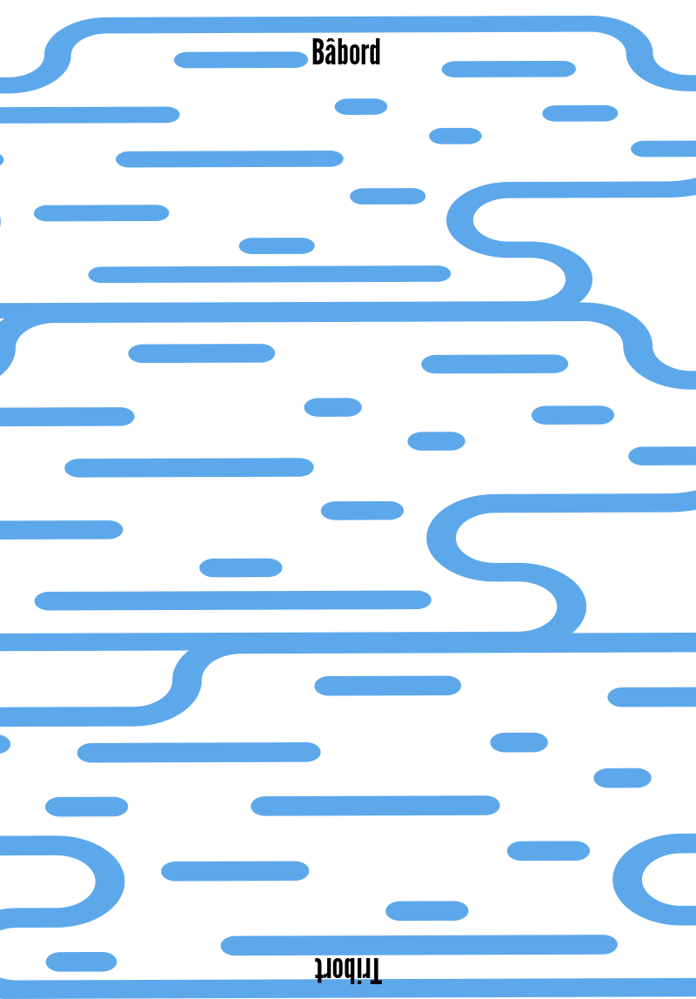
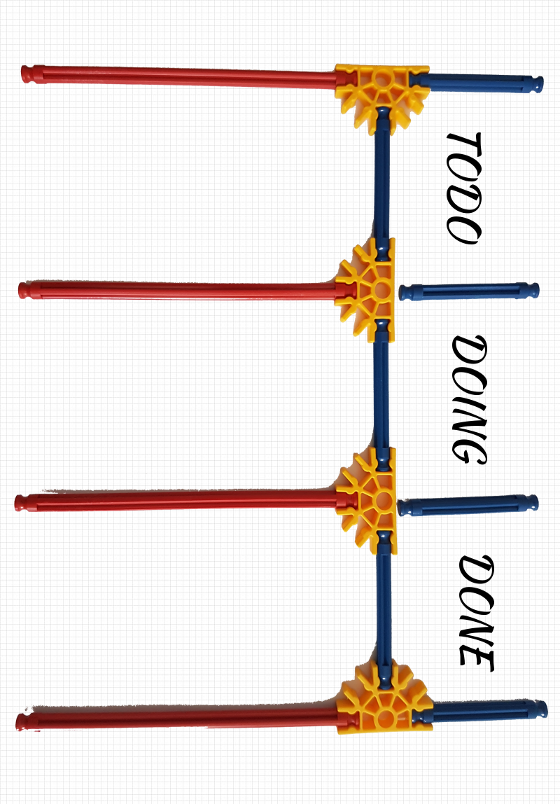

# Sensibilisation DevOps

## Objectifs
Comment rendre complémentaires des objectifs opposés en apparence ?  
Objectif implicite induit de l’équipe de réalisation : introduire le maximum de fonctionnalités.  
Objectif implicite induit de l’équipe d’infrastructure : garantir la stabilité de la réalisation.  

## Durée
De 1h (très rapide) à 2h (bon rythme)

## Matériel nécessaire
* Jeu de Knex
* 2 espaces pour séparer les équipes
* 1 environnement de “Production” (table)
* Les annexes ci-dessous

***

## Déroulement
Le but du jeu est de construire un pont au dessus d'un court d'eau en répondant aux différentes fonctionnalités proposées (CF. annexes ci-dessous).

Pour chaque fonctionnalité réalisée, un nombre de point est attribué au groupe (CF carte de fonctionnalité)

Séparer en 2 équipes de 5 personnes maximum (1 équipe de Dev et 1 équipe Ops).

### Prise en main des K'nex
Bien que facile à utiliser, peu de personnes connaissent vraiment les K'nex et leurs innombrables possibilités, il est donc important de laisser quelques minutes aux équipes pour les manipuler avant.

Proposer leur de reproduire cette balançoire par exemple :

### Le socle commun
Expliquer et montrer aux 2 équipes le socle qui sera maintenu par l’équipe Ops.  
Ce socle est un pilier unique placé au centre du court d'eau, le pont devra être placé au dessus.

Chaque équipe peut alors construire son propre socle à partir de l'image ci-dessous :

Ensuite, le jeu se déroule en 3 itérations :

***

### 1ère itération

(Situation traditionnelle)

Les 2 équipes sont séparées dans des salles différentes et ont chacun leur tableau de pilotage visuel (TODO, DOING, DONE)

Les Devs doivent réaliser les fonctionnalités obligatoires du Sprint #1 (CF. Cartes) et un document d'installation  à fournir aux Ops + la backlog facultative si le temps le leur permet.

Les Ops doivent stabiliser les piliers avec les demandes associées au Sprint #1.

A la fin de l'itération, les 2 équipes se réunissent autour d’un environnement de production. Les Dev livrent le contenu de leur production (sans le socle) + leur procédure d’installation.  
Un des Ops est désigné pour faire l’installation en production en moins de 2 minutes sur l'unique base de la procédure d’installation (les autres personnes restent silencieuses)

#### Review 1ère itération
Constat : Divergence des besoins -  Pourquoi l’échec ?  
Faire émerger les actions à mettre en place par les participants :   
   * Plus de doc de procédure d’installation, du contact humain
   * Réunir les 2 équipes dans la même salle pour faciliter les échanges.

***

### 2ème itération

Sur la bases des actions choisis, l'itération #2 reprend :  
Les Devs doivent réaliser les fonctionnalités obligatoires du Sprint #2(CF. Cartes) + la backlog facultative si le temps le leur permet.  
Les Devs reparte de ce qui a été livré en production.  

Les Ops doivent faire évoluer les piliers avec les demandes associées au Sprint #2.

A l'issue de l'itération, les 2 équipes se réunissent autour d’un environnement de production. Les Dev livrent le contenu de leur production (sans le socle).

Un des Ops et un des Dev sont désignés pour faire l’installation en production, ensemble, en moins de 2 minutes.
(les autres personnes restent silencieuses)

> NB : le déroulement de cette itération peut être différent selon les actions mises en place par les participants suite à la review #1... Quoiqu'il arrive, laissez les mettre en place ce qu'ils ont choisis.

#### Review 2ème itération
Constat - problème de qualité - Pourquoi l’échec ?  
Faire émerger les actions à mettre en place par les participants :   
* Mise en place de Tests.
* Environnement de recette.
* Partager les objectifs (Pilotage visuel)

***

### 3ème itération
Sur la bases des actions choisis, l'itération #2 reprend :

Les Devs doivent réaliser les fonctionnalités obligatoires du Sprint #3(CF. Cartes) + la backlog facultative si le temps le leur permet.
Les Devs reparte de ce qui a été livré en production.

Les Ops doivent mettre en place les tests afin de garantir la qualité de la livraison et assurer la livraison de la réalisation depuis l’environnement de recette. (CF. Cartes)  
Exemple de tests de connexion entre le pont et le socle :  

Les Devs peuvent alors réaliser le pont et livrer en recette continuellement, tandis que les Ops ont réalisent les tests sur les productions en recette et réfléchissent à la future installation depuis la recette.

Finalement, les 2 équipes se réunissent autour d’un environnement de production et installent ensemble la solution.

#### Review 3ème itération
Constat : Réussite, Pourquoi ?  
Axes d’amélioration ?  

***

## Retour sur l’approche DevOps
La collaboration : cela s’apprend  
La collaboration, travailler en équipe est en fait une compétence individuelle qui s'apprend.  

### DevOps : c’est quoi ?
* Issu des mots anglais "development" (développement) et "operations" (exploitation).
* Mouvement créé en 2009, pour améliorer la qualité des services informatiques.
* Acteurs issus des univers du développement, de l'exploitation, de la qualité, des tests, de l’organisation, des méthodes (notamment agile ou lean).

### DevOps : les pratiques

Automatisation, et excellence technique :
* Rechercher l’automatisation, plus que la procédure : installation, tests
* Mettre en place une pré-production pour s’entraîner et valider une livraison avant son déploiement
* Assurer une montée en charge possible (et un mode dégradé de secours) (la structure doit supporter une feuille de papier, puis 1Kg, puis 5Kg )

### Culture
* Le développeur apprendra à anticiper la phase d’intégration en se rendant disponible,
* L’intégrateur apprendra à remonter ses problématiques d’intégration aux développeurs
* Passer d’un mode silo, à un mode coopération. Exemple : avoir une personne de l’infrastructure dans l’équipe de réalisation, et inversement
* Faire des livraisons en présence des 2 équipes

### Partage
* Partager des outils communs de monitoring commun  
ex : passer de 2 tableaux de bord distincts, à un seul visible des 2 équipes

### Mesure
* Mesure : performance, process, people. Kpi liés aux événements
* Passer des 2 objectifs fonctionnalités et stabilité, à 1 objectif valeur pour l’utilisateur.

### DevOps : Si nous ne devions retenir qu'une seule chose ?
<u>La communication</u>  
la première étape pour mettre en place l'approche DevOps est très simple : il suffit de faciliter la communication entre les équipes. Sans elle, vous aurez beau mettre en place tous les outils du monde, **ça ne fonctionnera pas**.  

***
[Vos créations](./creations/)
***

## Auteurs & Licence
Norsys (Benoit Hermant, Yan Matagne, Antoine Stalin)

 This work is licensed under a <a rel="license" href="http://creativecommons.org/licenses/by/4.0/">Creative Commons Attribution 4.0 International License</a>.

## Représentations
Norsys  
Agile Tour Lille 2016  
Agile tour Paris 2016  
Agile Tour Sofia 2016  

## Variantes
Avec le Jenga : https://drive.google.com/file/d/0B8x4-Ep6sHyJMWpsSTc0YTFKVDA/edit

## Annexes

* Les cartes  
* L'environnement :
* Pilotage visuel :

